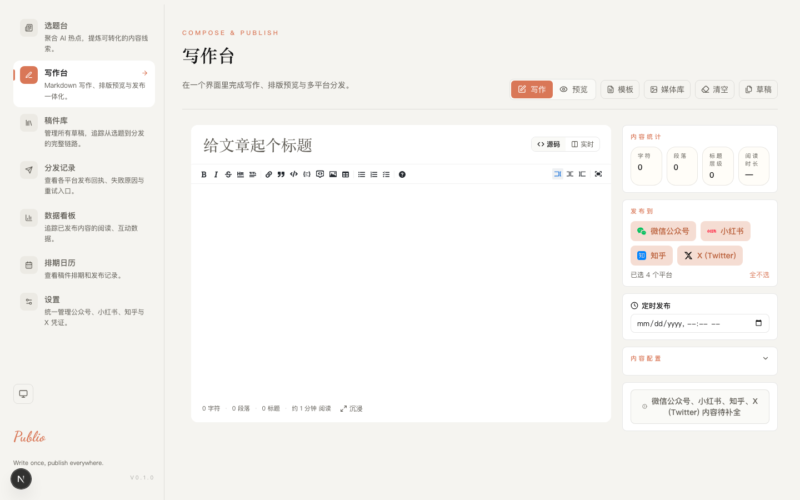
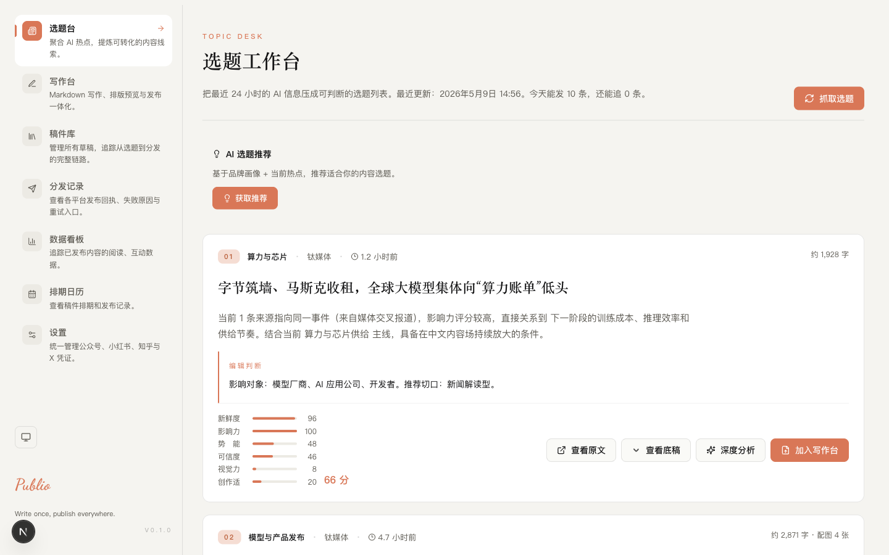
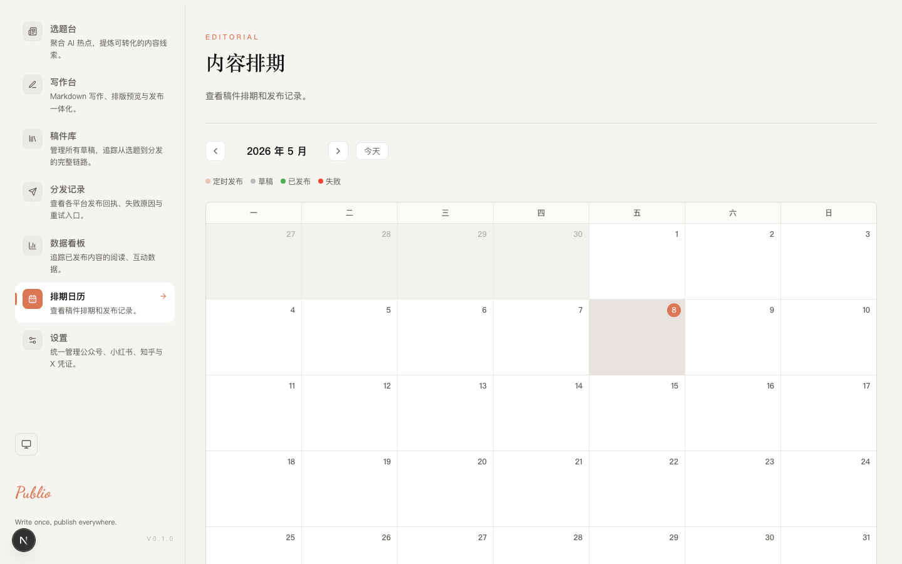
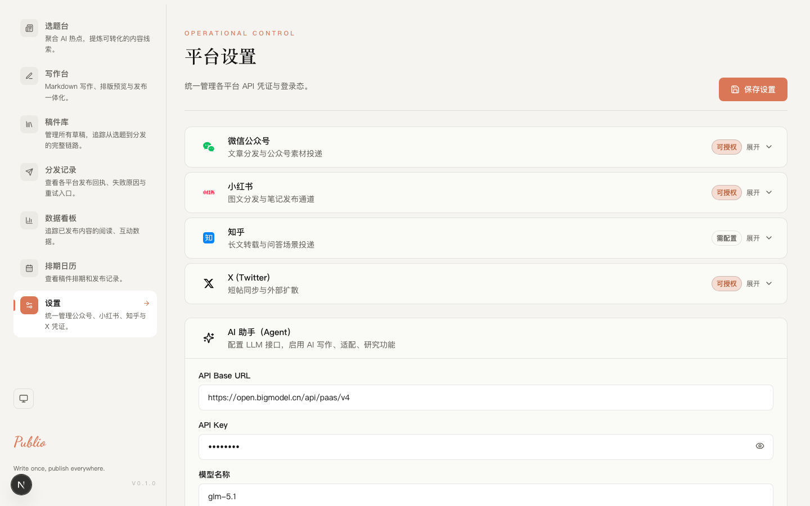

# Publio

[English](./README.md) | [中文](./README_zh.md)

[](./package.json)
[](./LICENSE)
[](./tsconfig.json)
[](https://nextjs.org/)
[](#测试)

> AI 原生内容运营平台。一次创作，全平台分发。

Publio 是多平台内容分发工具，整合 Markdown 编辑、AI 选题发现、内容适配和一键发布于统一工作台。支持微信公众号、小红书、知乎和 X (Twitter)。

---

## 功能特性

### 内容工作流

Publio 核心工作流覆盖内容创作全生命周期：

1. **信号收件箱** — 从 RSS 源摄入新闻信号，手动添加或 AI 发现
2. **选题库** — 将信号晋升为跟踪选题，生命周期管理（活跃 → 休眠 → 归档）
3. **写作大纲** — 每个选题的结构化 Brief：论点、大纲、平台发布计划
4. **写作台** — Markdown 编辑器 + AI 写作辅助、斜杠命令、自动保存
5. **渠道版本** — 每个平台独立的内容版本（同步、AI 适配、手动编辑）
6. **多平台发布** — 并发发布 + 进度追踪 + 定时发布
7. **内容复盘** — 发布后指标 → AI 复盘 → 经验沉淀 → 反哺推荐

### 写作台

- **Markdown 编辑器** — 桌面端实时预览，移动端降级方案
- **所见即所得模式** — 源码编辑与实时预览一键切换
- **沉浸式写作** — 全屏无干扰编辑，居中 720px 布局
- **自动保存** — 1 秒防抖，首次保存自动创建草稿
- **编辑上下文面板** — 标题状态、结构统计、可发布性指标
- **斜杠命令** — `/ai-expand`、`/ai-condense`、`/ai-rewrite`、`/ai-polish`、`/ai-continue`
- **版本历史** — 标题/内容变更自动快照，支持回滚
- **内容模板** — 6 个内置模板 + 自定义模板 CRUD
- **GitHub 图床** — 图片上传至 GitHub 仓库作为持久化图床

### AI Agent 系统

所有 AI 功能需 OpenAI 兼容 API（智谱 GLM、DeepSeek、Qwen、OpenAI、Ollama 等）。未配置时优雅降级。

| 能力 | 说明 |
|------|------|
| **写作助手** | 扩写、缩写、改写、润色、续写 — 斜杠命令触发，流式输出 |
| **平台适配** | 按平台规则重写内容（字数、格式约束） |
| **选题研究** | 新闻聚合深度分析，多角度洞察 |
| **发布诊断** | 失败原因分析，可操作重试建议 |
| **内容 Copilot** | 基于品牌画像 + 当前热点的选题推荐 |
| **风格学习** | 从历史草稿提取写作风格，注入 prompt |
| **多轮对话** | 会话持久化的 AI 对话面板 |

### AI 选题台

- 聚合 9+ 内置 RSS 源 + 用户自定义源
- **信号收件箱** — 分类处理信号（置顶、忽略、晋升为选题）
- **选题库** — 生命周期管理、关联 Brief、追踪表现
- 话题聚类，六维评分（新鲜度、影响力、势能、可信度、视觉就绪度、覆盖度）
- 每个聚合话题生成研究底稿：发生了什么、为什么重要、影响谁、推荐角度
- 一键转换为编辑器草稿，研究上下文自动嵌入

### 多平台发布

- `Promise.allSettled` 并发发布至所有已选平台
- **渠道版本** — 每个平台拥有独立的内容版本（从主稿同步、AI 适配、或手动编辑）
- **版本状态追踪** — 已同步 / AI 适配 / 已编辑 / 已检查 / 已排期 / 已发布
- **内容审核** — 敏感词检测，发布前弹窗警告
- **平台校验** — 自动规则检查（标题长度、内容限制、格式约束）
- **发布进度浮层** — 实时状态轮询，逐平台接收回执
- **分发任务追踪** — 失败诊断、智能重试、手动标记完成
- **定时发布** — 后端 cron 执行，持久化任务队列
- **发布后指标** — 阅读量、点赞、评论、分享聚合到分析看板，支持单任务和全量刷新

### 内容排期日历

- 月视图展示草稿、定时发布、已发布、失败事件
- 点击跳转编辑器或分发任务详情

### 今日工作台

- 统一面板展示各流程阶段的待办项
- 待处理信号、活跃选题、未完成 Brief、待发布版本、进行中任务
- 直接链接跳转至各工作流

### 数据管理

- **自动迁移** — schema 版本化，结构变更前自动备份
- **工作空间导入导出** — 导出所有实体（信号、选题、Brief、草稿、版本、任务、复盘）为 JSON；导入支持 dry-run 预览和合并语义

### 设置与配置

- 平台凭证管理，支持 OAuth 流程和连接验证
- AI Agent 配置（base URL、API key、模型），热更新无需重启
- 自定义 RSS 源管理
- 自定义 AI prompt 编辑器（按平台和全局）
- 品牌画像配置（用于内容 Copilot）
- 写作风格画像，支持从历史草稿自动分析

### 设计系统

- **主题切换** — 亮色 / 暗色 / 跟随系统，localStorage 持久化
- **设计 token** — 间距、字号、色彩、圆角，WCAG AA 合规对比度
- **响应式布局** — 桌面端侧边栏导航，自适应内容区

---

## 项目截图

<table>
  <tr>
    <td align="center"><b>写作台</b></td>
    <td align="center"><b>AI 选题台</b></td>
  </tr>
  <tr>
    <td></td>
    <td></td>
  </tr>
  <tr>
    <td align="center"><b>内容日历</b></td>
    <td align="center"><b>设置页</b></td>
  </tr>
  <tr>
    <td></td>
    <td></td>
  </tr>
</table>

---

## 快速开始

### 环境要求

- Node.js >= 18
- pnpm

### 安装

```bash
git clone https://github.com/rogerdigital/publio.git
cd publio
pnpm install
cp .env.example .env.local   # 配置平台凭证（也可稍后在设置页配置）
pnpm dev                      # 启动开发（含端口清理和缓存清除）
```

`pnpm dev` 自动清理残留 Next.js 进程并清除 `.next/cache`。使用 `pnpm run dev:raw` 跳过清理。

打开 http://localhost:3000。

### 命令

```bash
pnpm dev              # 开发模式（含端口清理）
pnpm build            # 生产构建
pnpm start            # 生产服务
pnpm preview           # 构建 + 启动
pnpm test             # 运行测试（Vitest）
pnpm lint             # ESLint
pnpm format           # Prettier 格式化
pnpm verify           # lint + test + build
```

---

## 配置

### 平台凭证

通过 `.env.local` 或设置页运行时管理：

| 平台 | 变量 | 获取方式 |
|------|------|---------|
| 微信公众号 | `WECHAT_APP_ID`, `WECHAT_APP_SECRET` | [mp.weixin.qq.com](https://mp.weixin.qq.com/) > 开发 > 基本配置 |
| 小红书 | `XHS_APP_ID`, `XHS_APP_SECRET`, `XHS_ACCESS_TOKEN` | [小红书开放平台](https://open.xiaohongshu.com/) |
| 知乎 | `ZHIHU_COOKIE` | 浏览器 DevTools > Network > 复制 Cookie |
| X (Twitter) | `X_API_KEY`, `X_API_SECRET`, `X_ACCESS_TOKEN`, `X_ACCESS_TOKEN_SECRET` | [developer.x.com](https://developer.x.com/) |

### AI Agent（可选）

三项必填才能启用 AI 功能：

| 变量 | 说明 |
|------|------|
| `AGENT_BASE_URL` | OpenAI 兼容端点（如 `https://api.openai.com/v1`） |
| `AGENT_API_KEY` | 对应服务商的 API key |
| `AGENT_MODEL` | 模型名（如 `gpt-4o-mini`、`deepseek-chat`、`glm-4-flash`） |
| `AGENT_MAX_TOKENS` | 可选，默认 2048 |
| `AGENT_TEMPERATURE` | 可选，默认 0.7 |

### GitHub 图床（可选）

启用图片上传至 GitHub 仓库作为持久化图床。通过设置页或 `.env.local` 配置：

| 变量 | 说明 |
|------|------|
| `GITHUB_IMAGE_ENABLED` | 设为 `true` 启用 |
| `GITHUB_IMAGE_TOKEN` | GitHub personal access token（需 repo scope） |
| `GITHUB_IMAGE_OWNER` | GitHub 用户名或组织 |
| `GITHUB_IMAGE_REPO` | 目标仓库名 |
| `GITHUB_IMAGE_BRANCH` | 可选，默认 `main` |
| `GITHUB_IMAGE_PATH` | 可选，默认 `images/` |

---

## 架构

```
src/
├── app/                        # Next.js App Router
│   ├── page.tsx                  # Server Component（metadata + shell）
│   ├── page-client.tsx           # Client Component（编辑器 + 面板）
│   ├── ai-news/                  # AI 选题工作台
│   ├── analytics/                # 发布后指标看板
│   ├── calendar/                 # 内容排期日历
│   ├── drafts/                   # 稿件库
│   ├── settings/                 # 平台与 AI 配置
│   ├── sync-tasks/               # 分发任务追踪
│   └── api/                      # Route Handlers
│       ├── agent/                  # AI 端点（写作、适配、研究、诊断、对话、复盘）
│       ├── copilot/                # 内容 Copilot（画像、推荐、风格）
│       ├── signals/                # Signal 收件箱 CRUD
│       ├── topics/                 # Topic 库 CRUD
│       ├── briefs/                 # Brief CRUD
│       ├── drafts/                 # 草稿 CRUD
│       ├── feedback/               # 内容复盘 CRUD
│       ├── export/                 # 工作空间导出
│       ├── import/                 # 工作空间导入
│       ├── metrics/                # 指标采集
│       ├── platforms/              # 平台连接管理
│       ├── publish/                # 发布端点
│       ├── rss-sources/            # 自定义 RSS CRUD
│       ├── sync-tasks/             # 分发任务管理
│       ├── templates/              # 自定义模板 CRUD
│       ├── upload/                 # 图片上传（GitHub 图床）
│       └── custom-prompts/         # 自定义 prompt CRUD
├── components/
│   ├── layout/                   # AppShellHeader, Sidebar, SurfaceCard, ThemeToggle
│   ├── editor/                   # MarkdownEditor, TemplatePicker, SlashCommandMenu, ImmersiveMode, WYSIWYG 切换
│   ├── news/                     # AiNewsPageClient, TopicSignalCard, ScoreBar
│   ├── publish/                  # PlatformSelector, PublishButton, ModerationWarning, PreviewPanel
│   ├── sync/                     # SyncTaskList, SyncTaskDetail
│   ├── agent/                    # AgentPanel, AgentStreamOutput
│   ├── copilot/                  # BrandProfileForm, TopicRecommendationPanel, StyleProfile
│   ├── analytics/                # MetricsCard
│   ├── calendar/                 # CalendarPageClient
│   └── drafts/                   # DraftLibraryClient
├── hooks/                        # useAutoSave, useSlashCommands, useAgentStream, useImmersiveMode
├── lib/
│   ├── agent/                    # LLM provider、流式传输、prompt 模板
│   ├── ai-news/                  # RSS 聚合、聚类、评分、信号持久化
│   ├── signals/                  # Signal 收件箱存储
│   ├── topics/                   # Topic 库存储
│   ├── briefs/                   # Brief 存储
│   ├── copilot/                  # 品牌画像、风格学习、选题推荐
│   ├── custom-prompts/           # 自定义 prompt 存储
│   ├── drafts/                   # 草稿 CRUD（含版本历史）
│   ├── export/                   # 工作空间导入导出
│   ├── feedback/                 # 内容复盘存储
│   ├── metrics/                  # 发布后指标与聚合
│   ├── moderation/               # 敏感词检测
│   ├── platformAdapters/         # 按平台适配内容格式
│   ├── platformConnections/      # 连接管理与 OAuth
│   ├── platformRules/            # 平台内容校验规则
│   ├── platformVariants/         # 渠道版本存储
│   ├── publishers/               # 平台发布逻辑
│   ├── rss-sources/              # 自定义 RSS 源存储
│   ├── scheduler/                # 定时发布执行
│   ├── storage/                  # JSON 文件集合、env 文件、数据迁移
│   ├── sync/                     # 分发任务状态机
│   ├── templates/                # 自定义模板存储
│   └── upload/                   # GitHub 图片上传
├── stores/                       # Zustand stores（publishStore, agentStore, toastStore）
├── styles/                       # 设计 token（间距、字号、色彩、圆角）
└── types/                        # TypeScript 类型定义
```

---

## 技术栈

| 层级 | 技术 |
|------|------|
| 框架 | Next.js 15（App Router, React 19） |
| 语言 | TypeScript 5（严格模式） |
| 样式 | vanilla-extract（`@vanilla-extract/css` + `@vanilla-extract/recipes`） |
| 状态 | Zustand 5 |
| 编辑器 | @uiw/react-md-editor |
| Markdown | marked 15 |
| LLM 流式传输 | OpenAI 兼容 SSE（fetch + ReadableStream） |
| 社交 API | twitter-api-v2 |
| 代码检查 | ESLint 9 + eslint-config-next |
| 格式化 | Prettier |
| 测试 | Vitest + Testing Library |
| Git Hooks | Husky + lint-staged |
| 包管理 | pnpm |

---

## 测试

```bash
pnpm test           # 运行所有测试
pnpm test -- --watch  # 监听模式
```

64 个测试文件，332 个测试用例，覆盖 stores、API 路由、组件和工具函数。

---

## 设计 Token

集中在 `src/styles/tokens.css.ts`：

- **间距**: xs(4px) 到 4xl(40px)
- **字号**: xs(12px) 到 4xl(28px)，行高 tight/base/relaxed
- **色彩**: 暖色调，橙/棕基调 (#D97757) accent，WCAG AA 合规对比度
- **圆角**: sm(4px), md(6px), lg(8px), xl(12px)
- **主题**: 亮色、暗色、跟随系统

---

## 许可证

[MIT](./LICENSE)
